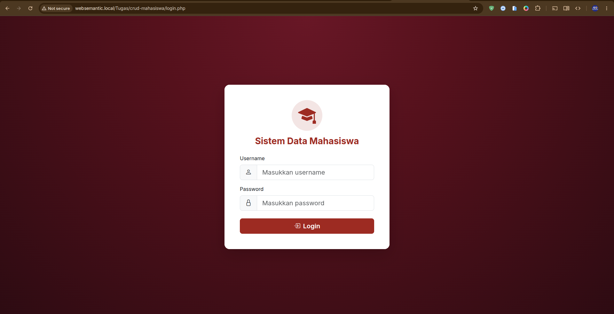
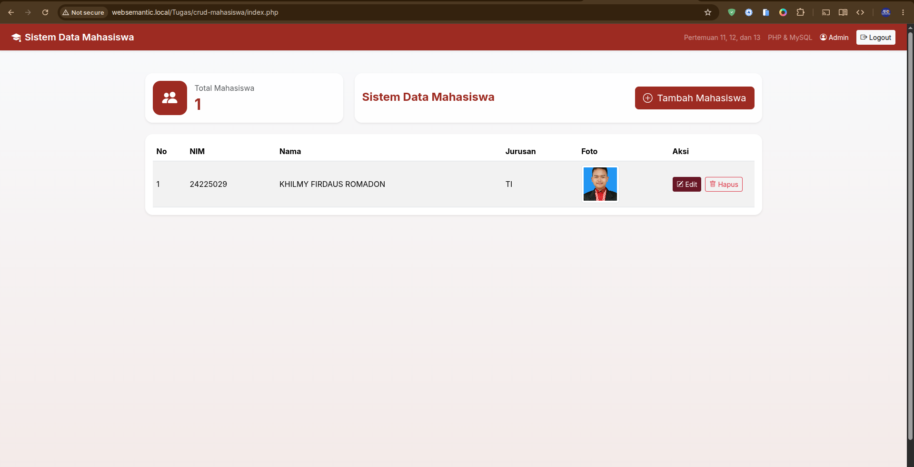
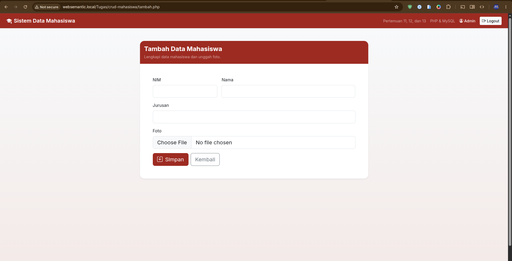
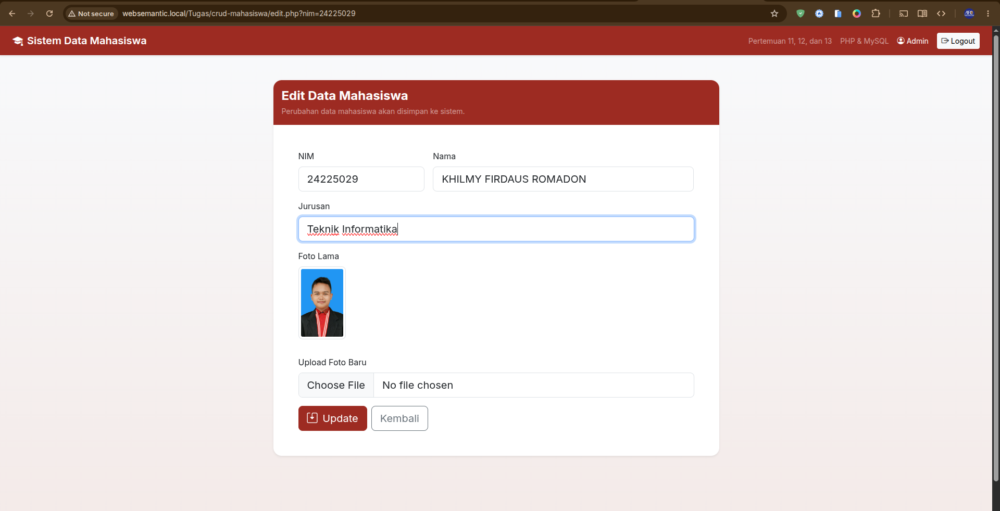

```text
Nama         : Khilmy Firdaus Romadon
NIM          : 24225029
Mata Kuliah  : Web Semantic
Studi Kasus  : Sistem Data Mahasiswa
```

# Sistem Data Mahasiswa Berbasis PHP & MySQL

Implementasi Materi Pertemuan 11, 12, dan 13  
Mata Kuliah Web Semantic

## Deskripsi Studi Kasus

Project ini merangkum tiga materi, yaitu operasi CRUD berbasis PHP-MySQL, sistem login dengan session, dan mekanisme upload file. Jadi, aplikasi ini bukan cuma berfungsi sebagai alat pengelolaan data, tapi juga jadi bukti nyata bahwa materi Pertemuan 11, 12, dan 13 sudah dipahami dan diterapkan secara terpadu.

## Implementasi Pertemuan 11

### CRUD

#### CREATE

Berikut bagian kode pada `insert.php` yang menangani proses penambahan data mahasiswa:

```php
$nim = mysqli_real_escape_string($conn, $_POST['nim']);
$nama = mysqli_real_escape_string($conn, $_POST['nama']);
$jurusan = mysqli_real_escape_string($conn, $_POST['jurusan']);

$namaBaru = time() . "_" . preg_replace('/[^a-zA-Z0-9._-]/', '_', $namaFile);
move_uploaded_file($tmpFile, "uploads/" . $namaBaru);

mysqli_query($conn, "INSERT INTO mahasiswa (nim, nama, jurusan, foto) VALUES ('$nim', '$nama', '$jurusan', '$namaBaru')");
$_SESSION['success'] = 'Data mahasiswa berhasil disimpan';
header("Location: index.php");
exit;
```

Singkatnya, kode ini mengambil data dari form, membersihkan input dengan `mysqli_real_escape_string()` supaya lebih aman, lalu memproses nama file foto dan memindahkannya ke folder `uploads/`. Setelah itu, data baru disimpan ke tabel `mahasiswa` lewat query `INSERT`.

#### READ

Untuk menampilkan data mahasiswa, `index.php` menjalankan query berikut:

```php
$data = mysqli_query($conn, "SELECT * FROM mahasiswa ORDER BY nim ASC");
$totalMahasiswa = mysqli_num_rows($data);
mysqli_data_seek($data, 0);
```

Data tersebut kemudian ditampilkan ke dalam tabel HTML lewat perulangan seperti ini:

```php
<?php $no=1; while($row = mysqli_fetch_assoc($data)) { ?>
<tr>
  <td><?= $no++; ?></td>
  <td><?= htmlspecialchars($row['nim']); ?></td>
  <td><?= htmlspecialchars($row['nama']); ?></td>
  <td><?= htmlspecialchars($row['jurusan']); ?></td>
</tr>
<?php } ?>
```

Query `SELECT` di atas mengambil semua data mahasiswa, lalu menampilkannya secara berurutan berdasarkan `nim`.

#### UPDATE

Proses pengubahan data mahasiswa di `update.php` ditangani lewat kode berikut:

```php
$nim = mysqli_real_escape_string($conn, $_POST['nim']);
$nama = mysqli_real_escape_string($conn, $_POST['nama']);
$jurusan = mysqli_real_escape_string($conn, $_POST['jurusan']);

if (!empty($_FILES['foto']['name'])) {
    $namaBaru = time() . "_" . preg_replace('/[^a-zA-Z0-9._-]/', '_', $namaFile);
    move_uploaded_file($tmpFile, "uploads/" . $namaBaru);

    mysqli_query($conn, "UPDATE mahasiswa SET nama='$nama', jurusan='$jurusan', foto='$namaBaru' WHERE nim='$nim'");
} else {
    mysqli_query($conn, "UPDATE mahasiswa SET nama='$nama', jurusan='$jurusan' WHERE nim='$nim'");
}
```

Data mahasiswa diperbarui berdasarkan `nim`. Kalau admin mengunggah foto baru, field `foto` ikut diperbarui; kalau tidak, hanya `nama` dan `jurusan` saja yang berubah.

#### DELETE

Penghapusan data dilakukan di `delete.php` dengan kode berikut:

```php
$nim = mysqli_real_escape_string($conn, $_GET['nim']);
$query = mysqli_query($conn, "SELECT foto FROM mahasiswa WHERE nim='$nim'");
$data = mysqli_fetch_assoc($query);

if ($data && !empty($data['foto']) && file_exists('uploads/'.$data['foto'])) {
    unlink('uploads/'.$data['foto']);
}

mysqli_query($conn, "DELETE FROM mahasiswa WHERE nim='$nim'");
$_SESSION['success'] = 'Data mahasiswa berhasil dihapus.';
header("Location: index.php");
exit;
```

Sebelum menghapus data dari database, kode ini akan mengecek dan menghapus dulu foto mahasiswa dari folder `uploads/` apabila filenya ada. Setelah itu, query `DELETE` baru dijalankan untuk menghapus datanya dari database.

## Implementasi Pertemuan 12

### Login

Berikut tampilan form login yang ada di `login.php`:

```php
<form method="POST" action="proses_login.php" class="needs-validation" novalidate>
  <div class="mb-3">
    <label class="form-label">Username</label>
    <div class="input-group input-group-lg">
      <span class="input-group-text"><i class="bi bi-person"></i></span>
      <input type="text" class="form-control" name="username" placeholder="Masukkan username" required autofocus>
    </div>
  </div>
  <div class="mb-4">
    <label class="form-label">Password</label>
    <div class="input-group input-group-lg">
      <span class="input-group-text"><i class="bi bi-lock"></i></span>
      <input type="password" class="form-control" name="password" placeholder="Masukkan password" required>
    </div>
  </div>
  <button type="submit" class="btn btn-primary btn-lg w-100 fw-semibold">
    <i class="bi bi-box-arrow-in-right me-1"></i> Login
  </button>
</form>
```

Sementara itu, verifikasi username dan password dilakukan di `proses_login.php` lewat kode ini:

```php
$username = mysqli_real_escape_string($conn, $_POST['username']);
$password = mysqli_real_escape_string($conn, $_POST['password']);

$query = mysqli_query($conn, "SELECT * FROM user WHERE username='$username' AND password='$password'");
$data = mysqli_fetch_assoc($query);

if ($data) {
    $_SESSION['username'] = $data['username'];
    $_SESSION['success'] = 'Selamat Datang Admin';
    header("Location: index.php");
    exit;
}
```

Kode ini mencocokkan `username` dan `password` yang dimasukkan dengan data di tabel `user`. Kalau cocok, username disimpan ke dalam session sebagai tanda bahwa admin sudah login.

### Proteksi Halaman

Halaman-halaman penting dilindungi lewat `auth.php`, menggunakan kode ini:

```php
session_start();
if (!isset($_SESSION['username'])) {
    header("Location: login.php");
    exit;
}
```

Dengan kode ini, halaman seperti dashboard, tambah data, edit data, delete, dan update hanya bisa diakses kalau user sudah login.

### Logout

Untuk logout, `logout.php` menjalankan kode berikut:

```php
session_start();
$_SESSION = [];
session_destroy();
session_start();
$_SESSION['success'] = 'Berhasil Logout';
header("Location: login.php");
exit;
```

Proses ini menghapus semua data session lewat `session_destroy()`, kemudian mengarahkan user kembali ke halaman login.

## Implementasi Pertemuan 13

### Upload Foto

Proses upload foto di `insert.php` memanfaatkan variabel `$_FILES` dan fungsi `move_uploaded_file()`:

```php
$namaFile = $_FILES['foto']['name'];
$tmpFile = $_FILES['foto']['tmp_name'];
$ukuran = $_FILES['foto']['size'];
$ext = strtolower(pathinfo($namaFile, PATHINFO_EXTENSION));

$namaBaru = time() . "_" . preg_replace('/[^a-zA-Z0-9._-]/', '_', $namaFile);
move_uploaded_file($tmpFile, "uploads/" . $namaBaru);
```

Mekanisme yang sama juga dipakai di `update.php`, saat admin memilih mengganti foto lama dengan yang baru.

### Menampilkan Foto

Untuk menampilkan foto mahasiswa, `index.php` menggunakan kode berikut:

```php
<?php if (!empty($row['foto']) && file_exists('uploads/'.$row['foto'])) { ?>
  " class="img-thumbnail rounded object-fit-cover" style="width:80px;height:80px;" alt="Foto <?= htmlspecialchars($row['nama']); ?>">
<?php } else { ?>
  <span class="text-muted small">Tidak ada foto</span>
<?php } ?>
```

Gambar akan muncul kalau nama file fotonya tersimpan di database dan file fisiknya benar-benar ada di folder `uploads/`.

### Validasi Upload

Validasi upload foto sudah diterapkan di `insert.php` dan `update.php`, lewat kode berikut:

```php
$ekstensi = ['png', 'jpg', 'jpeg'];

if (!in_array($ext, $ekstensi)) {
    $_SESSION['error'] = 'Format file tidak valid. Gunakan png, jpg, atau jpeg.';
    header('Location: tambah.php');
    exit;
}

if ($ukuran > 2000000) {
    $_SESSION['error'] = 'File terlalu besar. Maksimal 2 MB.';
    header('Location: tambah.php');
    exit;
}
```

Dengan validasi ini, hanya file gambar berekstensi `png`, `jpg`, atau `jpeg` yang bisa diunggah, dengan ukuran maksimal 2 MB.

## Struktur Database

Berikut struktur tabel yang digunakan, sesuai isi file `database.sql`:

```sql
CREATE TABLE IF NOT EXISTS user (
  id INT AUTO_INCREMENT PRIMARY KEY,
  username VARCHAR(50) NOT NULL UNIQUE,
  password VARCHAR(100) NOT NULL
);
```

```sql
CREATE TABLE IF NOT EXISTS mahasiswa (
  nim VARCHAR(10) PRIMARY KEY,
  nama VARCHAR(50) NOT NULL,
  jurusan VARCHAR(50) NOT NULL,
  foto VARCHAR(100) DEFAULT NULL
);
```

File `database.sql` ini juga sudah mencakup pembuatan database `kampus` beserta data awal (seed) untuk user admin:

```sql
CREATE DATABASE IF NOT EXISTS kampus;
USE kampus;

INSERT INTO user (username, password)
VALUES ('admin', '12345')
ON DUPLICATE KEY UPDATE username = username;
```

## Struktur Folder

Berikut struktur folder project secara aktual:

```text
crud-mahasiswa/
├── README.md
├── assets/
│   └── css/
│       └── theme.css
├── auth.php
├── database.sql
├── delete.php
├── docs/
├── edit.php
├── index.php
├── insert.php
├── koneksi.php
├── login.php
├── logout.php
├── partials/
│   ├── alerts.php
│   ├── footer.php
│   └── header.php
├── proses_login.php
├── tambah.php
├── update.php
└── uploads/
    └── 1782096080_saya.jpeg
```

---

## Screenshot Implementasi

### Login



### Dashboard



### Tambah Mahasiswa



### Edit Mahasiswa



---

## Hasil Pengujian

```text
Login         : Berhasil
Logout        : Berhasil
Tambah Data   : Berhasil
Edit Data     : Berhasil
Hapus Data    : Berhasil
Upload Foto   : Berhasil
Tampil Foto   : Berhasil
```

## Repository Github

```text
https://github.com/ndeso17/web-semantic
```
